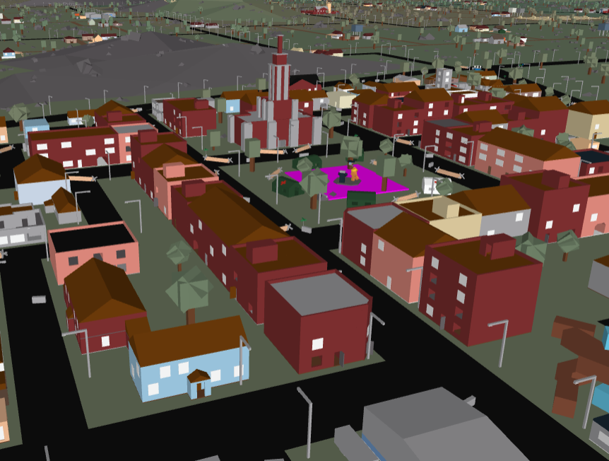

# rblx-to-obj
It's pretty self-explanatory, but you can also convert rbxm files. 'rbxl-to-obj' was just a better name for marketing purposes. It only supports three primitives right now, but more are anticipated for the future, including meshes.



## Usage
Just do `cargo run place.rbxl` and you'll get a `place.obj` file in the same directory.

Like I said, rbxm files can also be parsed (probably), but I haven't tested it, nor do I care.

## Installation w/ Cargo
```
cargo install rbx_obj
```

The crate's name is discrepant to this repo IK.
